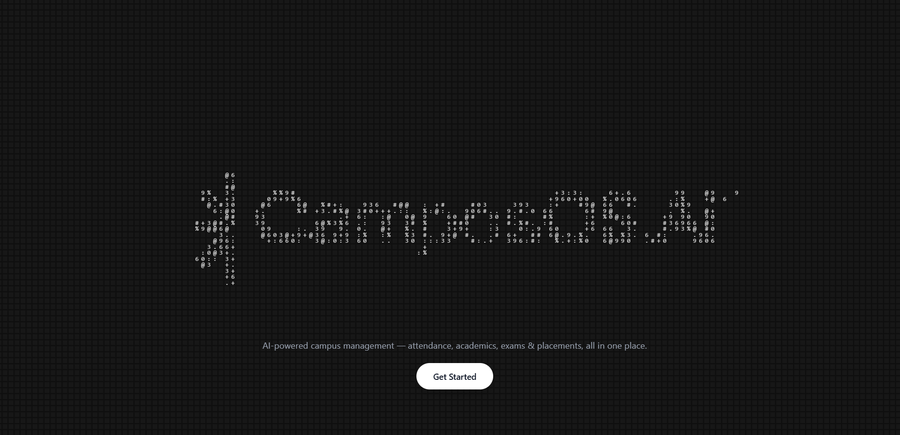
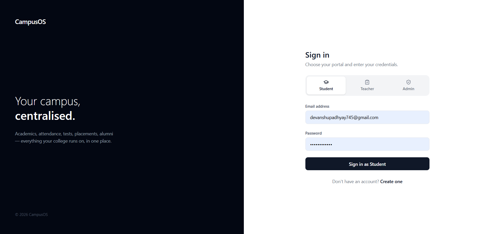
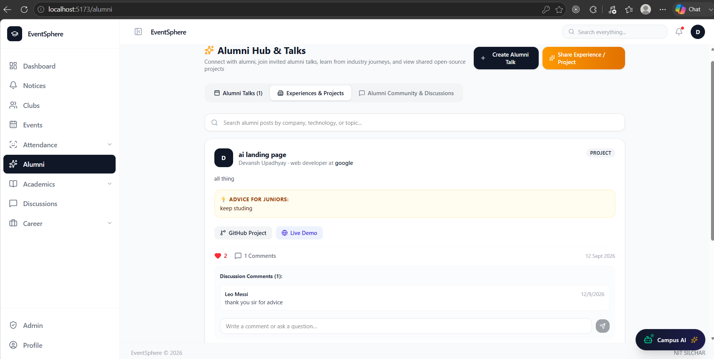
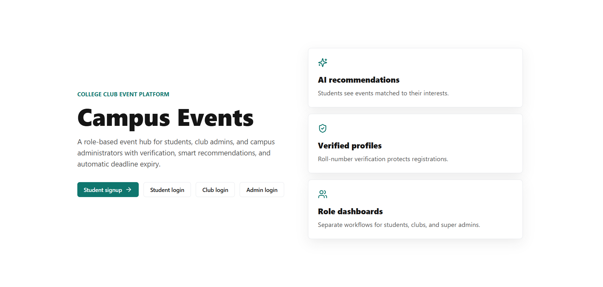
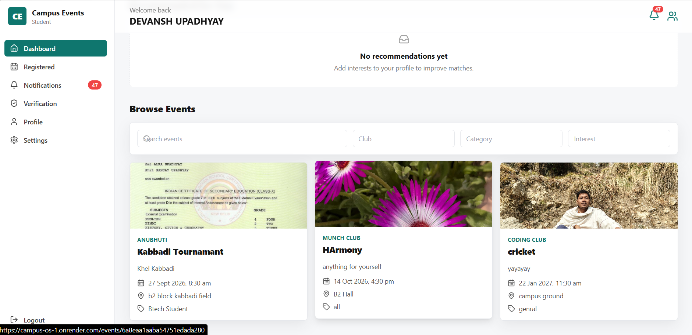
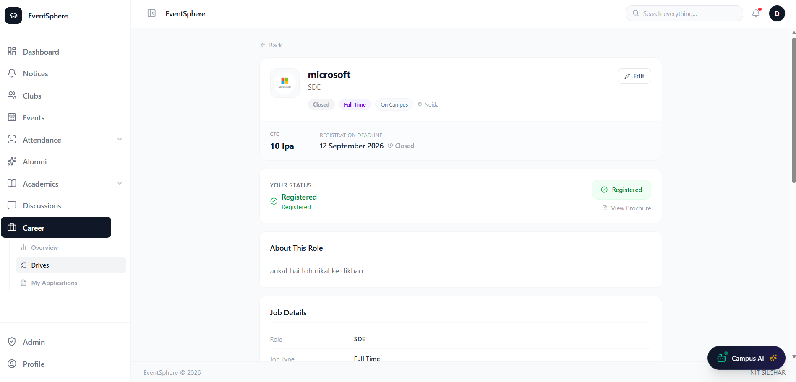

# 🏫 CampusOS

A full-stack **MERN-based college management and campus engagement platform** that brings academics, student communities, campus events, discussions, notices, and placement management into one unified application.

CampusOS is designed to provide students, faculty, clubs, and administrators with a centralized platform to manage everyday college activities and stay connected with campus opportunities.

---

## 🚀 Live Demo

> 🚧 **Coming Soon**

---

## 📸 Screenshots

### Welcome



### Dashboard



### Alumni



### Clubs



### Events




### Placement Portal



### Admin Panel


---

# ✨ Features

## 🔐 Authentication & Authorization

* JWT-based authentication
* Access & refresh token authentication
* Secure password hashing using bcrypt
* Protected routes
* Role-Based Access Control (RBAC)
* Authentication middleware
* Authorization middleware

---

## 📊 Dashboard

Personalized dashboards provide users with a quick overview of important campus activities.

* Personalized dashboard
* Today's summary
* Upcoming deadlines
* Upcoming events
* Latest notices
* Recent placement drives
* Activity statistics

---

# 📚 Classroom Module

The Classroom module helps students manage their academic activities and resources.

### Features

* Subject management
* Dynamic timetable *(planned)*
* Study resources
* Assignment deadlines
* Class representative management
* Competitive preparation resources
* Academic information

---

# 👥 Community Module

CampusOS provides a centralized space for students to interact, participate, and collaborate.

## 🏛️ Clubs

* Browse clubs
* Follow clubs
* Club administration
* Club announcements
* Club logos and banners
* Club activities

## 🎫 Events

* Event creation
* Event registration
* Event organizers
* Event announcements
* Event posters
* Event participation tracking

## 💬 Discussions

* Community discussions
* Create discussion threads
* Replies
* Moderation support
* Community interaction

---

# 💼 Placement Portal

The Placement Portal helps students discover and manage placement opportunities.

### Features

* Placement drives
* Eligibility checking
* Apply for placement drives
* Application tracking
* Application status
* Placement dashboard
* Placement-related information

---

# 📢 Notice System

CampusOS supports targeted notices across different sections of the platform.

### Notice Categories

* Platform
* Classroom
* Clubs
* Events
* Placement

### Features

* Priority levels
* Expiry dates
* Dynamic notice feed
* Metadata-based notices
* Targeted notifications

---

# 👤 User Profile

Users can manage and view their personal campus information.

* Student profile
* Academic information
* Community activity
* Placement activity
* Personal statistics
* Profile picture

---

# 🛡️ Admin Panel

Administrators can manage and moderate different areas of CampusOS.

### Features

* Manage clubs
* Manage placement drives
* Manage events
* Discussion moderation
* Platform management
* User management
* Notice management

---

# ☁️ File Upload System

CampusOS uses cloud-based file storage for managing application media.

### Features

* Cloudinary integration
* Image uploads using Multer
* Reusable upload component
* Profile pictures
* Club logos
* Club banners
* Event posters
* Automatic temporary file cleanup

---

# 🧰 Tech Stack

## Frontend

* React.js
* React Router
* Tailwind CSS
* Axios
* Context API
* Lucide React

## Backend

* Node.js
* Express.js
* MongoDB
* Mongoose
* JWT
* bcrypt
* Multer
* Cloudinary

## Development Tools

* Git
* GitHub
* VS Code
* Postman

---

# 🏗️ Project Architecture

CampusOS follows a layered backend architecture to maintain separation of concerns and improve scalability.

```text
                    Client
                      │
                      ▼
                 React Frontend
                      │
                      │ HTTP / REST API
                      ▼
                Express.js Server
                      │
             ┌────────┴────────┐
             ▼                 ▼
          Routes          Middleware
             │                 │
             └────────┬────────┘
                      ▼
                 Controllers
                      │
                      ▼
                   Services
                      │
                      ▼
                 Mongoose Models
                      │
                      ▼
                   MongoDB
```

Authentication, authorization, validation, error handling, and other common operations are handled through reusable middleware.

---

# 📁 Project Structure

```text
CampusOS/
│
├── frontend/
│   ├── public/
│   ├── src/
│   │   ├── api/
│   │   ├── components/
│   │   ├── context/
│   │   ├── pages/
│   │   ├── routes/
│   │   └── ...
│   └── package.json
│
├── backend/
│   ├── config/
│   ├── constants/
│   ├── controllers/
│   ├── middleware/
│   ├── models/
│   ├── routes/
│   ├── services/
│   ├── sockets/
│   ├── utils/
│   └── package.json
│
├── screenshots/
│   ├── dashboard.png
│   ├── classroom.png
│   ├── clubs.png
│   ├── events.png
│   ├── discussions.png
│   ├── placement.png
│   └── admin.png
│
├── .gitignore
└── README.md
```

---

# ⚙️ Installation & Setup

## 1. Clone the Repository

```bash
https://github.com/Deva-TECH-droid/CampusOS.AI
```

Navigate into the project:

```bash
cd CampusOS
```

---

# 🔧 Backend Setup

Navigate to the backend directory:

```bash
cd backend
```

Install dependencies:

```bash
npm install
```

Create a `.env` file inside the `backend` directory.

```env
MONGO_URI=your_mongodb_connection_string

CLIENT_URL=http://localhost:5173

PORT=5000

JWT_ACCESS_SECRET=your_long_random_access_secret
JWT_REFRESH_SECRET=your_long_random_refresh_secret

JWT_ACCESS_EXPIRY=15m
JWT_REFRESH_EXPIRY=7d

INTERNAL_CHATBOT_SECRET=your_long_random_chatbot_secret

ADMIN_EMAIL=adminmail@gmail.com
ADMIN_PASSWORD=your_admin_password
ADMIN_FIRST_NAME=your_first_name
ADMIN_LAST_NAME=your_last_name
```

> ⚠️ Never commit your `.env` file or expose database credentials, JWT secrets, or admin credentials publicly.

Start the backend:

```bash
npm run dev
```

---

# 💻 Frontend Setup

Open another terminal and navigate to the frontend:

```bash
cd frontend
```

Install dependencies:

```bash
npm install
```

Start the development server:

```bash
npm run dev
```

The frontend will normally be available at:

```text
http://localhost:5173
```

---

# 🔑 Environment Variables

The application requires environment variables for database connectivity, authentication, and application configuration.

| Variable                  | Description                            |
| ------------------------- | -------------------------------------- |
| `MONGO_URI`               | MongoDB connection string              |
| `CLIENT_URL`              | Frontend application URL               |
| `PORT`                    | Backend server port                    |
| `JWT_ACCESS_SECRET`       | Secret used for access tokens          |
| `JWT_REFRESH_SECRET`      | Secret used for refresh tokens         |
| `JWT_ACCESS_EXPIRY`       | Access token expiration                |
| `JWT_REFRESH_EXPIRY`      | Refresh token expiration               |
| `INTERNAL_CHATBOT_SECRET` | Internal chatbot authentication secret |
| `ADMIN_EMAIL`             | Initial admin email                    |
| `ADMIN_PASSWORD`          | Initial admin password                 |
| `ADMIN_FIRST_NAME`        | Initial admin first name               |
| `ADMIN_LAST_NAME`         | Initial admin last name                |

---

# 🔄 Application Flow

```text
User
 │
 ▼
React Frontend
 │
 ▼
Axios API Requests
 │
 ▼
Express Routes
 │
 ▼
Authentication / Authorization
 │
 ▼
Controllers
 │
 ▼
Services
 │
 ▼
Mongoose
 │
 ▼
MongoDB
```

---

# 🔮 Upcoming Features

The following features are planned for future releases:

* ⚡ Real-time updates using Socket.IO
* 🤖 AI-powered chatbot
* 🔎 Global search
* 🔔 Notification system
* 🤖 AI-powered recommendations
* 📱 Browser push notifications
* 🐳 Docker support
* ⏰ Background job processing
* 📊 Advanced analytics
* 📚 Enhanced academic management

---

# 🤝 Contributing

Contributions, suggestions, and feedback are welcome.

To contribute:

1. Fork the repository
2. Create a new branch

```bash
git checkout -b feature/your-feature
```

3. Make your changes
4. Commit your changes

```bash
git add .
git commit -m "Add your feature"
```

5. Push your branch

```bash
git push origin feature/your-feature
```

6. Open a Pull Request

---

# 🐛 Issues & Feedback

If you find a bug or have a feature suggestion, feel free to open an issue in the repository.

---

# 📄 License

This project is licensed under the **MIT License**.

---

# 👨‍💻 Authors

### Devansh Upadhyay

Contibutor

### Vimarsh Srivastava

Contributor

### Shreyansh Tripathi

Contributor

### Himanshu Singh

Contributor

---

# ⭐ Support

If you find CampusOS useful or interesting, consider giving the repository a ⭐ on GitHub.

---

